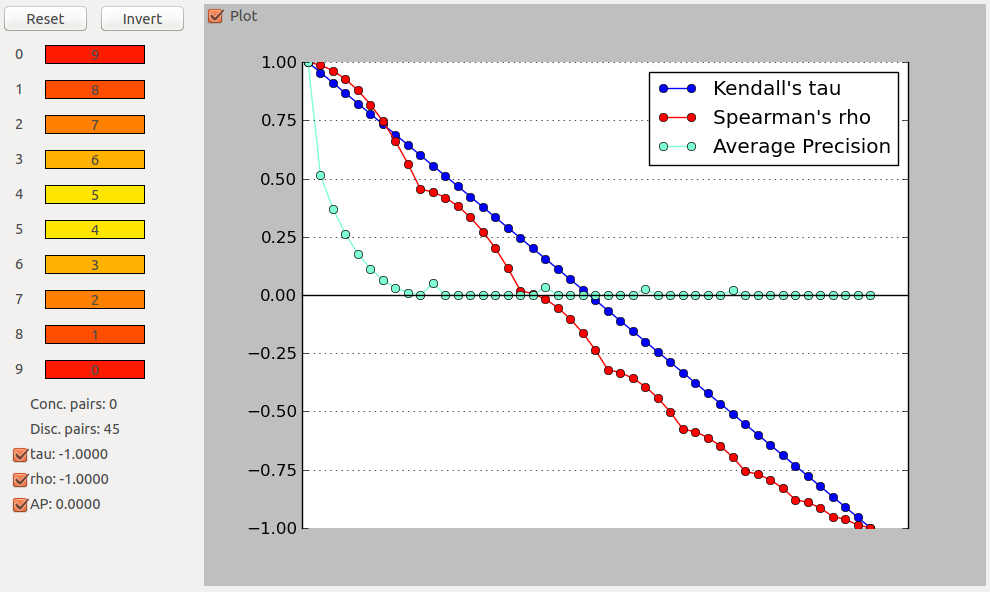

rank-corr
=========

This is a Python application designed to teach the rank correlation measures [Kendall's tau](http://en.wikipedia.org/wiki/Kendall's_tau), [Spearman's rho](http://en.wikipedia.org/wiki/Spearman's_rank_correlation_coefficient), and [average precision](http://en.wikipedia.org/wiki/Average_precision#Average_precision).

While these commonly used measures are easy to compute, it may be a bit difficult to understand their behaviour just by looking at the formulas. This application helps to get a better intuition of rank correlation measures by providing a drag-and-droppable ranked list as an interactive toy example and directly plotting the results.




Requirements
============

### PyQt4

On Debian/Ubuntu: ```apt-get install python-qt4```

Other Systems: http://www.riverbankcomputing.com/software/pyqt/download

### Matplotlib

Using pip: ```pip install matplotlib```

Or: http://matplotlib.org/downloads.html

### NumPy

Using pip: ```pip install numpy```

Or: http://scipy.org/Download


Installation
===========

Do: ```git clone https://github.com/noutenki/rank-corr.git rank-corr```

Then run the program with: ```python rank_corr.py```
